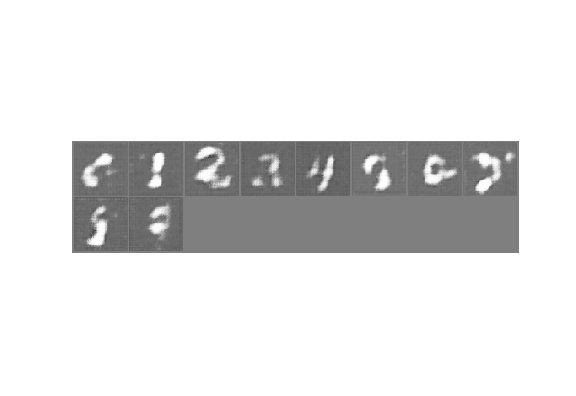
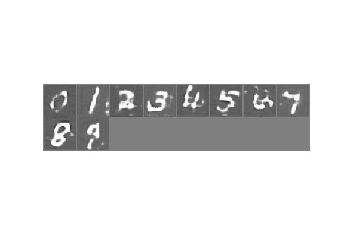
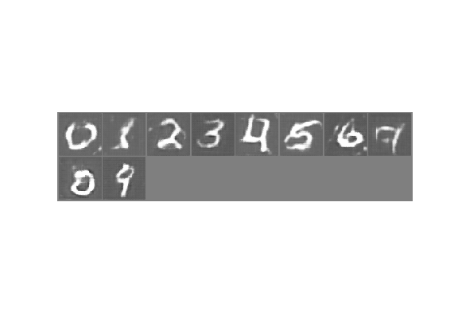
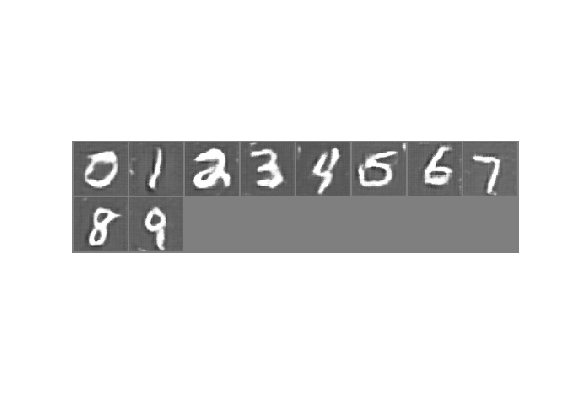
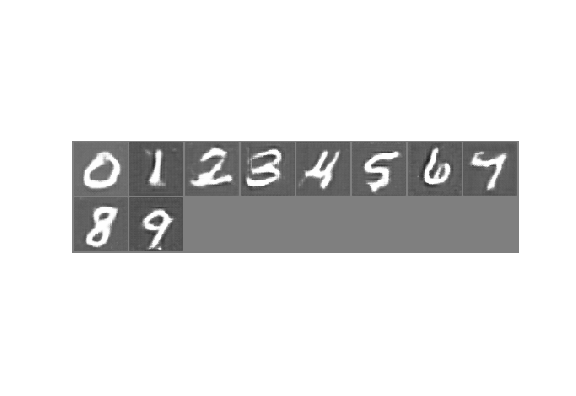

# ACGAN_mnist
An Auxiliary Classifier GAN(ACGAN) in PyTorch to generate MNIST digits.

## Literature survey

- The orginal ACGAN paper - [https://arxiv.org/abs/1610.09585]
- Code heavily inspired by <a href = "https://github.com/pytorch/examples/blob/master/dcgan/main.py">dcgan pytorch</a> repo. 
- A lot of tuning and hacks borrowed from <a href = "https://github.com/soumith/ganhacks">this</a> awesome repo.

## Tips

### Keep in mind that these tips are those which worked in this specific project. These may or may not work if you are generating stuff other than MNIST digits. 

#### General
 - Keep the architectures of G and D symmetric. 
 - Use ReLU in G and BatchNorm + LReLU in D.
 - Add dropout layers in D to make it 'weaker'. 
 
 #### Things that drastically improved performance
 - Label smoothing for D
 - Label flipping for D
 - Adding Dropout layers in G

## Results
- epoch 2 iteration 200/700

- epoch 4 iteration 500/700

- epoch 6 iteration 500/700

- epoch 8 iteration 400/700

- epoch 10 iteration 200/700

